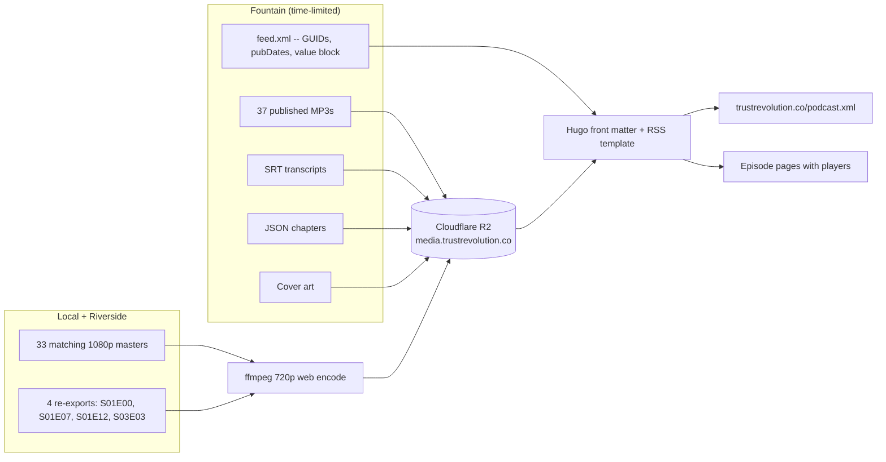
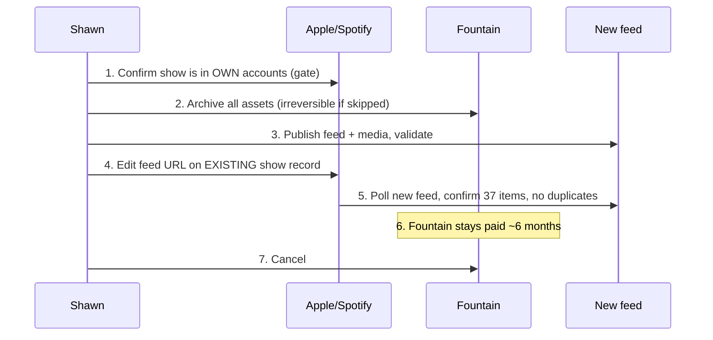

# feat: Migrate podcast media and RSS off Fountain to Cloudflare R2

## Summary

Trust Revolution is going on indefinite hiatus, and the $25/mo Fountain subscription is the only thing keeping the back catalogue reachable. Fountain is not merely the "Listen on Fountain" link target — it is the origin host for the RSS feed that Apple Podcasts polls *and* for all 37 audio enclosures. Cancelling without a replacement takes down Apple and Spotify along with the site's CTAs.

This plan moves media to Cloudflare R2 on a Trust Revolution subdomain, has Hugo emit the podcast feed, adds native audio and video players to episode pages, and repoints Apple and Spotify to the new feed. Steady-state cost drops from $300/yr to roughly $9/yr.

---

## Problem Frame

**Current state.** `hugo.toml:18` points at `https://feeds.fountain.fm/OIYZniSDb9jd3Pb78CpF`. That URL is registered with Apple Podcasts (confirmed via the iTunes lookup API) and serves 37 items totalling 1.57 GB of MP3 enclosures, plus HLS video, SRT transcripts, JSON chapters, and cover art — all on `feeds.fountain.fm`. The website has no audio player at all: `audio_url` is referenced in exactly one template (`layouts/partials/structured-data.html`, JSON-LD only) and `video_url` is referenced in none.

**Why it is urgent.** Fountain has a documented on-ramp and no off-ramp: no feed export, no bulk media download, no custom feed domain, and no evidence of any Fountain-side 301 or `itunes:new-feed-url` control. Their Terms of Use §12–13 say only that content "may be removed" after termination, with no grace period stated. Once the subscription lapses, the media may become unretrievable with no warning.

**The ownership gap.** The Fountain feed contains no `<itunes:owner>` and no `<itunes:email>`. That is the credential Spotify mails a verification code to when you claim a show. Its absence means directory ownership recovery is not self-service today, and it is the single largest unknown in this migration.

---

## Goal Capsule

Move every asset the back catalogue depends on onto infrastructure Shawn controls, keep the Apple and Spotify listings alive with their ratings and subscriber history intact, give trustrevolution.co real playback for the first time, and reduce ongoing cost to near zero — all before the Fountain subscription is cancelled.

---

## Requirements

| ID | Requirement |
|----|-------------|
| R1 | Every published asset (37 MP3s, transcripts, chapters, cover art) is archived off Fountain before cancellation, verified by byte count and playability. |
| R2 | Audio is served from a Trust Revolution-controlled subdomain backed by R2, with HTTP Range support so podcast apps can seek and resume. |
| R3 | Hugo emits a Podcasting 2.0-compliant RSS feed at a stable URL on trustrevolution.co. |
| R4 | The new feed preserves all 37 item GUIDs and `podcast:guid` byte-identically, so no listener re-downloads the catalogue and no duplicate show is created. |
| R5 | The new feed carries `<itunes:owner>` and `<itunes:email>`, permanently fixing the ownership-recovery gap. |
| R6 | `podcast:value` Lightning splits continue to route sats to the Alby addresses, with the Fountain 2% recipient removed. |
| R7 | Episode pages gain a working audio player and a working video player, styled to the existing brutalist design system. |
| R8 | Video is served from local Riverside masters re-encoded for web, not rebuilt from Fountain's HLS. |
| R9 | Apple Podcasts and Spotify point at the new feed with the existing show records preserved — never resubmitted as new shows. |
| R10 | Steady-state hosting cost is under $2/month. |

---

## Key Technical Decisions

### KTD1. Cloudflare R2 over Vercel Blob, B2, or Bunny

R2 charges nothing for egress at any volume, so a back catalogue that spikes in traffic cannot generate a surprise bill on a show nobody is actively monitoring. Vercel Blob is technically capable — documented Range support, 5 TB file cap, edge-cached — but meters egress at $0.05/GB on a meter separate from the Pro bandwidth allowance, landing around $182/mo at 50k audio downloads versus $0 on R2, and it carries a $20/mo plan floor. Cloudflare's CDN terms normally prohibit serving video on Free/Pro/Business plans; R2 is expressly exempt, which also rules out the "B2 fronted by free Cloudflare" pattern.

Serve from a custom subdomain — the `r2.dev` public URL is documented as development-only and rate-limited.

### KTD2. Audio comes from Fountain; video comes from local masters

The 37 MP3s on Fountain are the *published edits* — the exact audio listeners heard. Local Riverside exports are raw sessions and differ in length (S01E07 by 172s, S01E12 by 387s). Re-deriving audio from masters would silently change what subscribers hear, so audio is pulled from Fountain while it is still live.

Video has no such constraint: nobody has heard a canonical video cut through the feed, and 33 of 37 local masters match the published duration within a second. So video is encoded from local 1080p masters, and the four gaps (S01E00 trailer, S01E07, S01E12, S03E03 — which has clips only) are re-exported from Riverside. This removes any need to rebuild ~22,000 HLS segments from Fountain.

### KTD3. The feed carries video, because this is an archival migration

**This plan preserves everything Fountain published, at full fidelity.** Nothing is dropped because it is inconvenient to reproduce, and no part of the published catalogue is treated as optional. That principle governs every decision below and overrides arguments from effort or reach.

So the feed carries video via `podcast:alternateEnclosure` alongside the MP3 enclosure, as Fountain's did, plus chapters and transcripts on all 37 items. `scripts/verify-feed.js` enforces this: a generated feed that drops video, chapters, or a transcript from any item fails the build.

The one deliberate difference is the container. Fountain served an HLS ladder; this serves progressive MP4, which `alternateEnclosure` accepts equally and which is one file per episode instead of ~600 segments. Video is encoded from local Riverside masters rather than pulled from Fountain (KTD2), so the HLS ladder was never the source.

Apple and Spotify video is explicitly out of scope and not a gap to revisit. Apple currently holds all 37 episodes as audio pointing at Fountain's MP3s, so nothing is lost there by moving. The archive that matters is the site and the feed.

### KTD4. Enclosure URLs may change freely; GUIDs may not

Apple's guidance is explicit: GUIDs must never change, and an enclosure URL is used as the GUID only when no explicit GUID is present. All 37 items carry `<guid isPermaLink="false">` UUIDs, so moving enclosures to R2 causes zero re-downloads and zero duplicates — provided the GUIDs, `pubDate`s, and `podcast:guid` are copied character-for-character from the archived XML rather than regenerated. Script the extraction; do not transcribe by hand.

### KTD5. Directory cutover is a dashboard edit, never a resubmission

Apple documents two paths for changing a feed URL: a 301 from the old host, or an edit in Podcasts Connect. Fountain forecloses the first. Editing the URL on the existing show record preserves the show ID, ratings, reviews, and subscribers; submitting the new feed via "Add a Show" creates a second listing and the original's reputation is unrecoverable.

### KTD6. Fountain stays paid through a hold period

Without a 301, anyone subscribed directly to the raw `feeds.fountain.fm` URL in Overcast, Pocket Casts, or Podverse never learns the new location. Keeping `podcast:guid` identical lets Podcast Index re-associate the feeds, recovering apps that resolve through the Index. For everyone else, the old feed staying up is the only thing still serving them. Apple's four-week minimum assumes a working redirect; six months is the right hold here.

---

## High-Level Technical Design

Asset provenance — two sources converge on R2:



Cutover sequence — the ordering is what protects the listings:



---

## Output Structure

R2 bucket layout, served at `media.trustrevolution.co`:

```
audio/s01e01.mp3              # published cuts, pulled from Fountain
audio/s01e02.mp3
...
video/s01e01.mp4              # 720p web encode from local master
...
transcripts/s01e01.srt
chapters/s01e01.json
art/cover.jpg
art/s01e01.jpg
```

Slugs follow the existing `content/episodes/` naming (`s01e01`, `s03e07`), giving stable, guessable URLs independent of Fountain's UUID paths.

---

## Scope Boundaries

**In scope.** Media archival and re-hosting, Hugo RSS feed generation, front matter migration, audio and video players on episode pages, Apple and Spotify cutover, Fountain decommissioning.

**Non-goals.** Redesigning episode pages beyond adding players. Changing episode copy, titles, or artwork. Migrating the site off Netlify. Rebuilding Fountain's analytics. Reproducing Fountain paid subscriptions, boostagram composing, or livestreams — those are app-side features with no RSS equivalent.

### Deferred to Follow-Up Work

- Serving an adaptive-bitrate HLS ladder. Progressive MP4 carries the same video through the same feed tag; the ladder was a Fountain delivery detail, not published content.
- Download analytics. If wanted later, a Cloudflare Worker in front of R2 can log requests.
- Retiring `scripts/create-episode-from-rss.js` and `scripts/update-episode-data.js`, both hardcoded to the Fountain feed, along with `.github/workflows/update-latest-episode.yml`. They are inert during hiatus; leave them until the show resumes.

---

## Implementation Units

### U1. Archive every Fountain asset while the subscription is live

**Goal:** Get an irreversible-loss-proof local copy of everything Fountain holds, before any other work.

**Requirements:** R1

**Dependencies:** none — this runs first and blocks nothing else on its outcome.

**Files:** `scripts/archive-fountain.js`, `docs/plans/fountain-archive-manifest.json`

**Approach:**
1. Save the raw feed XML as the canonical migration source; every GUID, pubDate, duration, and value-block detail is extracted from it later.
2. Parse the 37 items and download each MP3, SRT transcript, JSON chapters file, and per-episode artwork, plus channel cover art.
3. Name outputs by episode slug derived from season/episode in the feed, matching `content/episodes/` slugs.
4. Write a manifest recording, per asset, the source URL, byte count, and SHA-256.
5. Verify each MP3 is playable and its duration matches `itunes:duration` within two seconds.

**Execution note:** This is time-sensitive and the only step that cannot be redone later. Run it before touching anything else, and confirm the manifest before proceeding.

**Test scenarios:**
- All 37 items in the feed produce an archived MP3; a missing or truncated download fails loudly rather than being skipped.
- Archived byte counts match the `<enclosure length="">` attribute for every item.
- An episode whose transcript or chapters URL 404s is recorded in the manifest as absent rather than aborting the run.
- Re-running the script is idempotent — existing verified files are not re-downloaded.
- The feed XML is saved byte-identical, not reserialized by an XML parser.

**Verification:** Manifest shows 37/37 audio files archived with matching lengths, and a random sample of three MP3s plays end to end.

---

### U2. Confirm directory account ownership

**Goal:** Determine whether the Apple and Spotify show records are under Shawn's accounts or Fountain's. This gates the entire cutover.

**Requirements:** R9

**Dependencies:** none

**Files:** none — this is an operational check, recorded in the plan's Open Questions.

**Approach:** Log into Apple Podcasts Connect and confirm Trust Revolution appears and its RSS feed URL field is editable. Log into Spotify for Creators and confirm the show is claimed and its feed URL is editable. Separately, email Fountain asking three questions: do they support an outbound feed redirect, do they offer any media or feed export, and do they expose an Apple claim-token field.

**Execution note:** No code depends on this, but U8 is blocked until it resolves. If the show is under Fountain's Apple account, Apple's only documented recovery is a claim token the *host* must expose — the migration stalls at archive-and-hold until Fountain responds.

**Test expectation:** none — operational verification, no code.

**Verification:** Both dashboards confirmed editable, or the blocker is documented with Fountain's reply.

---

### U3. Assemble video masters

**Goal:** Have one authoritative source video per episode before encoding.

**Requirements:** R8

**Dependencies:** none

**Files:** `scripts/reconcile-video-masters.js`

**Approach:**
1. Probe every file under `~/Videos/Trust Revolution/` and match each episode directory to its published duration from the archived feed.
2. Emit a reconciliation report classifying each episode as matched, different-cut, or missing.
3. Re-export the four known gaps from Riverside: S01E00 (trailer, outside the `SxxExx` directory convention), S01E07 (local is 172s shorter than published), S01E12 (local is 387s longer), and S03E03 (clips only, no master).

**Test scenarios:**
- Every episode in the feed maps to exactly one master; ambiguous directories containing multiple long files are reported rather than silently resolved by picking the largest.
- Episodes whose best local match differs from published duration by more than 120 seconds are flagged as different-cut.
- Directories containing only clips (all files under 10 minutes) are flagged as missing, not matched.
- The report is regenerable and stable across runs.

**Verification:** Report shows 37/37 episodes with an assigned master and no unresolved flags.

---

### U4. Provision R2 and publish media

**Goal:** All media served from `media.trustrevolution.co` with Range support and long cache lifetimes.

**Requirements:** R2, R8, R10

**Dependencies:** U1, U3

**Files:** `scripts/encode-video.sh`, `scripts/upload-r2.js`

**Approach:**
1. Create the R2 bucket and bind a custom subdomain, since the `r2.dev` URL is rate-limited and documented as development-only.
2. Encode each master to a single 720p H.264 MP4 with AAC audio and `faststart` so playback begins before the full file downloads. Masters stay local as the archival source; only web renditions are uploaded.
3. Upload audio, video, transcripts, chapters, and artwork under the Output Structure layout.
4. Set long `Cache-Control` max-age on all objects — these files never change.
5. Verify content types are correct per extension, since a wrong type on an MP3 breaks podcast apps.

**Execution note:** The encode is a long unattended run. Verify one episode end to end before launching the full batch.

**Test scenarios:**
- A `Range: bytes=1000-1999` request against an uploaded MP3 returns HTTP 206 with a correct `Content-Range` — this is what podcast seeking depends on.
- Every uploaded MP3 returns `Content-Type: audio/mpeg` and every MP4 returns `video/mp4`.
- Encoded video duration matches its master within two seconds.
- Encoded MP4s play in Chrome, Firefox, and Safari without a plugin.
- Upload is idempotent — re-running skips objects whose checksums match.
- A deliberately corrupted upload is detected by checksum comparison rather than assumed good.

**Verification:** All assets fetch over HTTPS from the custom subdomain, Range requests return 206, and total R2 storage cost is confirmed under $1/month.

---

### U5. Generate the podcast RSS feed from Hugo

**Goal:** A Podcasting 2.0 feed on trustrevolution.co that directories accept as a continuation of the existing show.

**Requirements:** R3, R4, R5, R6

**Dependencies:** U1, U4

**Files:** `layouts/_default/podcast.xml`, `hugo.toml`, `layouts/podcast.xml` output-format registration

**Approach:**
1. Register a new Hugo output format so the podcast feed is emitted at a stable path distinct from the existing site feed. `layouts/_default/rss.xml` stays as-is — it is a blog-style feed over episodes and essays and is not a podcast feed.
2. Emit channel-level `itunes:*` metadata from the existing `[params.podcast]` block in `hugo.toml`, adding `<itunes:owner>` with name and email (R5).
3. Carry `podcast:guid`, `podcast:medium`, and the `podcast:value` block, dropping the Fountain 2% recipient so Trust Revolution takes 90% and NoGood 10% (R6). Re-point `podcast:funding` away from the Fountain support URL.
4. Emit per-item `<guid isPermaLink="false">`, `<pubDate>`, `<enclosure>` with R2 URL and true byte length, `itunes:duration`, `podcast:season`, `podcast:episode`, `podcast:chapters`, and `podcast:transcript`.
5. Source GUIDs and pubDates from front matter populated in U6 out of the archived XML — never regenerated.

**Execution note:** Validate against Apple's feed validator in Podcasts Connect before any dashboard edit. A malformed feed discovered after the URL switch is a live outage.

**Test scenarios:**
- The generated feed contains exactly 37 items.
- Every item GUID matches the archived Fountain feed character-for-character; a mismatch fails the build.
- `podcast:guid` equals `a7d58130-6f1d-4ff3-9c5a-aee3b8cc07cc`.
- Every `pubDate` matches the archived feed, so no app reports 37 new episodes.
- Every `<enclosure length="">` matches the actual byte size of the R2 object.
- The `podcast:value` block contains exactly two recipients summing to 100, with no Fountain address present.
- `<itunes:owner>` contains a name and a valid email.
- The feed passes an external podcast feed validator with no errors.
- An episode missing a transcript or chapters file omits the tag rather than emitting a broken URL.

**Verification:** Feed validates cleanly, and a diff against the archived Fountain feed shows differences confined to enclosure URLs, enclosure lengths, the value block, and added owner tags.

---

### U6. Migrate episode front matter to R2 and archived-feed data

**Goal:** Every episode carries the durable data the feed and players need, with no remaining Fountain dependency.

**Requirements:** R2, R4

**Dependencies:** U1, U4

**Files:** `content/episodes/*.md`, `scripts/migrate-front-matter.js`, `archetypes/episodes.md`

**Approach:**
1. Rewrite `audio_url`, `video_url`, and `transcript_url` in all 37 episode files to `media.trustrevolution.co` paths.
2. Add fields the feed requires that front matter does not yet carry: the item GUID, the enclosure byte length, and the chapters URL — all extracted from the archived XML.
3. Update `hugo.toml` to replace `fountain_rss_url` with the new feed URL, and decide the fate of `fountain_show_url` (see Open Questions).
4. Update `archetypes/episodes.md` so any future episode starts with the new shape.

**Test scenarios:**
- All 37 episode files parse as valid YAML front matter after rewriting.
- No file in `content/` or `layouts/` still references `feeds.fountain.fm` (grep-enforced).
- Every `audio_url` resolves to an object that exists in R2.
- Every GUID written to front matter matches the archived feed.
- `hugo --gc --minify` builds without error and the site renders.

**Verification:** Clean build, zero `fountain.fm` references outside documentation, and a spot-check of three episode pages showing correct media URLs.

---

### U7. Add audio and video players to episode pages

**Goal:** trustrevolution.co becomes a place you can actually listen and watch, ad-free.

**Requirements:** R7

**Dependencies:** U4, U6

**Files:** `layouts/partials/audio-player.html`, `layouts/partials/video-player.html`, `layouts/episodes/single.html`, `static/css/main.css`

**Approach:**
1. Build both players on native `<audio>` and `<video>` elements with `preload="metadata"` so page load is not burdened by media.
2. Style to the existing design system — no rounded corners, thick black borders, vermillion only for the play affordance, all sizing from existing `--spacing-*` and `--font-size-*` tokens rather than one-off values.
3. Place the audio player prominently on the episode page; present video as a secondary affordance since most listeners are audio-first.
4. Provide direct download links for both, so the archive stays portable.
5. Reconcile the Fountain CTA: `layouts/partials/fountain-cta.html` is used from `layouts/index.html`, `layouts/episodes/single.html`, and `layouts/_default/support.html`, so all three change together.

**Execution note:** Verify in a real browser at mobile and desktop widths before considering this done — a player that looks right in markup and breaks on a phone is the likely failure here.

**Test scenarios:**
- The audio player renders on every episode page and plays from the R2 URL.
- Seeking mid-file works, proving Range requests reach R2 correctly through the browser.
- The video player renders and plays without layout shift on load.
- Both players are keyboard-operable and expose accessible names to a screen reader.
- Controls meet the 44px minimum touch target on mobile widths.
- An episode with no `video_url` renders the audio player alone with no empty container or broken element.
- Player styling uses no hardcoded pixel values outside the token system.
- Contrast ratios on player controls meet WCAG AA.

**Verification:** Manual playback confirmed in Chrome and Safari at 375px and 1440px widths, keyboard-only operation confirmed, and a Lighthouse accessibility pass with no new violations.

---

### U8. Cut over Apple Podcasts and Spotify

**Goal:** Both directories serve the back catalogue from the new feed, on the existing show records.

**Requirements:** R9

**Dependencies:** U2 (blocking), U5, U6, U7

**Files:** none — operational.

**Approach:**
1. Confirm the new feed is live, validating, and serving all 37 items with working enclosures.
2. In Apple Podcasts Connect, edit the RSS feed URL on the *existing* show record. Never use "Add a Show".
3. In Spotify for Creators, update the feed URL on the existing show.
4. Wait up to 24 hours, then confirm both directories show 37 episodes with no duplicates and correct artwork.
5. Publish the new feed URL on the site and social channels, since raw-URL subscribers in Overcast and Pocket Casts have no redirect to follow.

**Execution note:** Do not cancel Fountain in the same session. Confirm both directories are serving from the new feed first.

**Test expectation:** none — operational verification, no code.

**Verification:** Apple and Spotify both list 37 episodes sourced from the new feed, playback works from both, and existing ratings and reviews are intact.

---

### U9. Decommission Fountain

**Goal:** End the $25/mo subscription without stranding more listeners than necessary.

**Requirements:** R10

**Dependencies:** U8

**Files:** `README.md`, `CLAUDE.md`, `AGENTS.md`

**Approach:** Hold the Fountain subscription for roughly six months after cutover so the old feed keeps serving raw-URL subscribers while Podcast Index re-associates on `podcast:guid`. Then cancel. Update repo documentation to describe the new media pipeline and mark the Fountain-dependent scripts as inert.

**Test expectation:** none — operational.

**Verification:** Subscription cancelled, site and feed unaffected, Apple and Spotify still serving.

---

## Verification Contract

- `hugo --gc --minify` builds clean with no template errors.
- The generated podcast feed passes an external validator and Apple's own validator.
- A GUID diff between the archived Fountain feed and the generated feed reports zero differences across all 37 items.
- Range requests against R2 audio return HTTP 206.
- No reference to `feeds.fountain.fm` remains in `content/`, `layouts/`, or `hugo.toml`.
- Audio and video play on a real episode page in Chrome and Safari, mobile and desktop.
- Apple and Spotify serve 37 episodes from the new feed with no duplicates.

## Definition of Done

Every Fountain asset is archived and verified locally. Media serves from `media.trustrevolution.co` with Range support. Hugo emits a valid podcast feed preserving all GUIDs, `podcast:guid`, and pubDates, carrying `itunes:owner`/`itunes:email` and a Fountain-free value block. Episode pages play audio and video. Apple and Spotify are cut over on their existing show records with ratings intact. Monthly cost is under $2. Fountain is scheduled for cancellation after the hold period.

---

## Risks & Dependencies

**Fountain revokes access before the archive completes.** Their terms permit content removal after termination with no stated grace period, and U1 is the only irreversible step. Mitigation: run U1 first, immediately, while the subscription is current and healthy.

**The show is not in Shawn's Apple or Spotify accounts.** This would block U8 entirely, since Apple's only documented recovery is a claim token the host must expose and the feed carries no `itunes:email` for Spotify's email path. Mitigation: U2 resolves this early; if it fails, the plan degrades to archive-and-hold and the decision becomes whether to pay Fountain or accept losing the listings.

**Raw-URL subscribers are unrecoverable.** With no 301, apps polling `feeds.fountain.fm` directly never learn the new location. Preserving `podcast:guid` recovers apps resolving through Podcast Index; the rest are lost. Accepted, not mitigable.

**GUID corruption creates 37 duplicate episodes.** Regenerating GUIDs or letting an XML library reserialize them would republish the entire catalogue to every subscriber. Mitigation: extract from the archived XML programmatically, and fail the build on any mismatch (U5 test scenarios).

**Different-cut masters produce audio/video length mismatches** on S01E07, S01E12, and S03E03. The published audio and the re-exported video will not align. Accepted — video is a secondary affordance and the feed is audio-only.

---

## Open Questions

1. **Are the Apple and Spotify show records under Shawn's accounts?** Blocking for U8. Resolved by U2.
2. **What email address goes in `<itunes:owner>`?** Needs a real, monitored inbox — this is the credential for all future ownership recovery.
3. **What subdomain?** Plan assumes `media.trustrevolution.co`.
4. **Does the Fountain CTA stay during the hold period?** Fountain still works for six months, and it remains a legitimate ad-free listening option. Suggested: keep it pointing at Fountain until cancellation, then repoint the CTA to the on-site player.
5. **Does the value block stay at all?** Sats streaming keeps working without Fountain, and dropping their 2% raises Trust Revolution's share to 90%. Assumed kept unless Shawn says otherwise.

---

## Sources & Research

- Live Fountain feed (`feeds.fountain.fm/OIYZniSDb9jd3Pb78CpF`) — primary evidence for GUIDs, value block, enclosure sizes, and the absent `itunes:owner`.
- iTunes lookup API — confirmed Apple polls the Fountain feed URL directly.
- [Cloudflare R2 pricing](https://developers.cloudflare.com/r2/pricing/) — zero egress, 10 GB free storage.
- [Vercel Blob pricing](https://vercel.com/docs/vercel-blob/usage-and-pricing) — rejected per KTD1.
- [Apple: change the RSS feed URL](https://podcasters.apple.com/support/837-change-the-rss-feed-url) and [claim your show](https://podcasters.apple.com/support/5497-claim-your-show).
- [Spotify: updating an RSS feed link](https://support.spotify.com/us/creators/article/updating-an-rss-feed-link-or-hosting-provider/).
- [Podcast Namespace: guid](https://podcastnamespace.org/tag/guid) and [value-recipient spec](https://github.com/Podcastindex-org/podcast-namespace/blob/main/docs/tags/value-recipient.md).
- [Fountain Terms of Use](https://fountain.fm/terms-of-use) §12–13 and [pricing](https://fountain.fm/pricing).
- Local reconciliation: 33/37 masters match published duration within 1 second; gaps at S01E00, S01E07, S01E12, S03E03.
